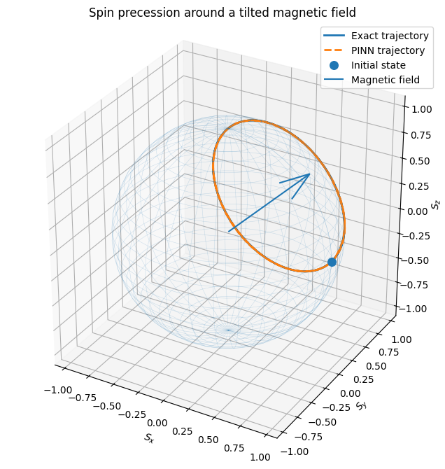

# Physics-Informed Neural Network for Spin-1/2 Precession

A compact Physics-Informed Neural Network (PINN) project for solving the Bloch equations of a spin-1/2 system in a static magnetic field.

The model is trained without a dataset of reference trajectories. Instead, it learns by minimizing the residuals of the governing differential equations, the initial-condition error, and violations of physical conservation laws.

## Overview

The project studies two configurations:

1. a magnetic field directed along the z-axis,
2. a magnetic field tilted in the xz-plane.

For both cases, the PINN prediction is compared with an analytical solution. The final trajectory is also visualized on the Bloch sphere.

## Theoretical background

### Spin-1/2 and the Bloch vector

A pure state of a two-level quantum system can be represented by a point on the Bloch sphere. Its Bloch vector is

```math
\mathbf{S}(t)
=
\begin{pmatrix}
S_x(t) \\
S_y(t) \\
S_z(t)
\end{pmatrix}.
```

For a pure state, the vector has unit length:

```math
\|\mathbf{S}(t)\|^2
=
S_x^2(t)+S_y^2(t)+S_z^2(t)
=
1.
```

The components of the Bloch vector are expectation values of the Pauli operators:

```math
S_i(t)=\langle \sigma_i\rangle,
\qquad i\in\{x,y,z\}.
```

The Pauli matrices are

```math
\sigma_x=
\begin{pmatrix}
0 & 1 \\
1 & 0
\end{pmatrix},
\qquad
\sigma_y=
\begin{pmatrix}
0 & -i \\
i & 0
\end{pmatrix},
\qquad
\sigma_z=
\begin{pmatrix}
1 & 0 \\
0 & -1
\end{pmatrix}.
```

### Spin in a static magnetic field

For a magnetic field

```math
\mathbf{B}
=
\begin{pmatrix}
B_x \\
B_y \\
B_z
\end{pmatrix},
```

the spin evolves according to the Bloch equation

```math
\frac{d\mathbf{S}}{dt}
=
\gamma\,\mathbf{S}\times\mathbf{B},
```

where gamma is the gyromagnetic ratio.

In this project, dimensionless units are used and

```math
\gamma=1.
```

Expanding the cross product gives

```math
\frac{dS_x}{dt}
=
\gamma\left(S_yB_z-S_zB_y\right),
```

```math
\frac{dS_y}{dt}
=
\gamma\left(S_zB_x-S_xB_z\right),
```

```math
\frac{dS_z}{dt}
=
\gamma\left(S_xB_y-S_yB_x\right).
```

The initial spin is

```math
\mathbf{S}(0)
=
\begin{pmatrix}
1 \\
0 \\
0
\end{pmatrix}.
```

### Conserved quantities

For a static field, two quantities are conserved.

The Bloch-vector norm:

```math
\|\mathbf{S}(t)\|^2=1.
```

The spin projection onto the field direction:

```math
\mathbf{S}(t)\cdot\hat{\mathbf{B}}
=
\mathbf{S}(0)\cdot\hat{\mathbf{B}},
\qquad
\hat{\mathbf{B}}
=
\frac{\mathbf{B}}{\|\mathbf{B}\|}.
```

These invariants are included directly in the training objective.

### Analytical solution

For a constant magnetic field, the spin rotates around the field direction with angular frequency

```math
\omega
=
\gamma\|\mathbf{B}\|.
```

Using Rodrigues' rotation formula, the exact trajectory is

```math
\mathbf{S}(t)
=
\mathbf{S}_0\cos\theta
+
\left(\mathbf{S}_0\times\hat{\mathbf{B}}\right)\sin\theta
+
\hat{\mathbf{B}}
\left(\mathbf{S}_0\cdot\hat{\mathbf{B}}\right)
\left(1-\cos\theta\right),
```

with

```math
\theta(t)=\omega t,
\qquad
\mathbf{S}_0=\mathbf{S}(0).
```

## Physics-Informed Neural Network

The neural network approximates the mapping

```math
t
\longmapsto
\left(S_x(t),S_y(t),S_z(t)\right).
```

### Architecture

```text
1 -> 64 -> 64 -> 64 -> 3
```

The model contains:

- one scalar input: time,
- three hidden layers,
- 64 neurons per hidden layer,
- `Tanh` activation functions,
- three outputs: `S_x`, `S_y`, and `S_z`.

`Tanh` is used because it is smooth and differentiable. PyTorch automatic differentiation computes the derivatives of the network outputs with respect to time.

## Loss function

The total loss is

```math
\mathcal{L}
=
\lambda_{\mathrm{physics}}\mathcal{L}_{\mathrm{physics}}
+
\lambda_{\mathrm{initial}}\mathcal{L}_{\mathrm{initial}}
+
\lambda_{\mathrm{norm}}\mathcal{L}_{\mathrm{norm}}
+
\lambda_{\mathrm{projection}}\mathcal{L}_{\mathrm{projection}}.
```

The weights used in the experiments are

```math
\lambda_{\mathrm{physics}}=5,
\qquad
\lambda_{\mathrm{initial}}=10,
\qquad
\lambda_{\mathrm{norm}}=5,
\qquad
\lambda_{\mathrm{projection}}=10.
```

### Physics residuals

```math
r_x
=
\frac{dS_x}{dt}
-
\gamma\left(S_yB_z-S_zB_y\right),
```

```math
r_y
=
\frac{dS_y}{dt}
-
\gamma\left(S_zB_x-S_xB_z\right),
```

```math
r_z
=
\frac{dS_z}{dt}
-
\gamma\left(S_xB_y-S_yB_x\right).
```

The physics loss is

```math
\mathcal{L}_{\mathrm{physics}}
=
\mathrm{MSE}(r_x)
+
\mathrm{MSE}(r_y)
+
\mathrm{MSE}(r_z).
```

### Initial-condition loss

```math
\mathcal{L}_{\mathrm{initial}}
=
\mathrm{MSE}
\left(
\mathbf{S}_{\mathrm{PINN}}(0),
\mathbf{S}_0
\right).
```

### Norm-conservation loss

```math
\mathcal{L}_{\mathrm{norm}}
=
\mathrm{MSE}
\left(
S_x^2+S_y^2+S_z^2,
1
\right).
```

### Field-projection loss

```math
\mathcal{L}_{\mathrm{projection}}
=
\mathrm{MSE}
\left(
\mathbf{S}_{\mathrm{PINN}}(t)\cdot\hat{\mathbf{B}},
\mathbf{S}_0\cdot\hat{\mathbf{B}}
\right).
```

The conservation terms improve long-time stability and prevent physically incorrect solutions with decaying amplitude or changing precession axis.

## Training configuration

| Parameter | Value |
|---|---:|
| Hidden layers | 3 |
| Neurons per hidden layer | 64 |
| Activation | `Tanh` |
| Optimizer | Adam |
| Learning rate | `5e-4` |
| Epochs | 10,000 |
| Collocation points | 300 |
| Time interval | `[0, 4π]` |
| Gradient clipping | 1.0 |
| Random seed | 42 |

## Experiments

### Experiment 1: field along the z-axis

The field is

```math
\mathbf{B}
=
\begin{pmatrix}
0 \\
0 \\
1
\end{pmatrix}.
```

The exact solution is

```math
S_x(t)=\cos t,
\qquad
S_y(t)=-\sin t,
\qquad
S_z(t)=0.
```

Typical evaluation results:

| Metric | Value |
|---|---:|
| MAE for `S_x` | `3.68e-3` |
| MAE for `S_y` | `1.62e-2` |
| MAE for `S_z` | `4.51e-3` |
| Mean norm error | `2.07e-2` |
| Maximum norm error | `4.63e-2` |

### Experiment 2: tilted field

The field is

```math
\mathbf{B}
=
\begin{pmatrix}
1/\sqrt{2} \\
0 \\
1/\sqrt{2}
\end{pmatrix}.
```

The conserved initial projection is

```math
\mathbf{S}_0\cdot\hat{\mathbf{B}}
=
\frac{1}{\sqrt{2}}.
```

Typical evaluation results:

| Metric | Value |
|---|---:|
| MAE for `S_x` | `1.40e-2` |
| MAE for `S_y` | `1.96e-2` |
| MAE for `S_z` | `1.40e-2` |
| Mean norm error | `3.70e-3` |
| Mean projection error | `2.10e-3` |

## Results

The PINN closely reproduces the analytical trajectory in both experiments.

For the tilted-field case:

- all three spin components are learned correctly,
- the Bloch-vector norm remains close to one,
- the spin projection onto the field direction remains nearly constant,
- the predicted trajectory nearly overlaps the analytical trajectory.



## Project structure

```text
pinn-spin-precession/
├── README.md
├── requirements.txt
├── .gitignore
├── pinn_spin_precession.ipynb
├── models/
│   ├── z_field_spin_pinn.pt
│   └── tilted_field_spin_pinn.pt
└── images/
    ├── z_field_solution.png
    ├── z_field_norm.png
    ├── tilted_field_solution.png
    ├── tilted_field_invariants.png
    └── bloch_sphere_tilted_field.png
```

## Installation

```bash
git clone https://github.com/YOUR_USERNAME/pinn-spin-precession.git
cd pinn-spin-precession

python -m venv .venv
```

Linux or macOS:

```bash
source .venv/bin/activate
```

Windows:

```powershell
.venv\Scripts\activate
```

Install the dependencies:

```bash
pip install -r requirements.txt
```

Start Jupyter Notebook:

```bash
jupyter notebook
```

Then open `pinn_spin_precession.ipynb` and run the cells from top to bottom.

## Requirements

```text
torch
numpy
matplotlib
jupyter
```

## Limitations

The current model assumes an ideal closed system in a static magnetic field. It does not include:

- longitudinal relaxation,
- transverse relaxation,
- decoherence,
- measurement noise,
- time-dependent control pulses,
- interactions between multiple spins.

## Possible extensions

- Rabi oscillations,
- time-dependent magnetic fields,
- relaxation times `T1` and `T2`,
- inverse estimation of the magnetic field,
- inverse estimation of the gyromagnetic ratio,
- adaptive collocation-point sampling,
- comparison with Runge-Kutta solvers,
- coupled multi-spin systems.

## Conclusion

This project demonstrates that a PINN can solve the Bloch equations without a conventional dataset of known trajectories.

The final model combines the differential-equation residual with the initial condition and two physical invariants. This substantially improves long-time accuracy and prevents convergence to physically invalid trajectories.
